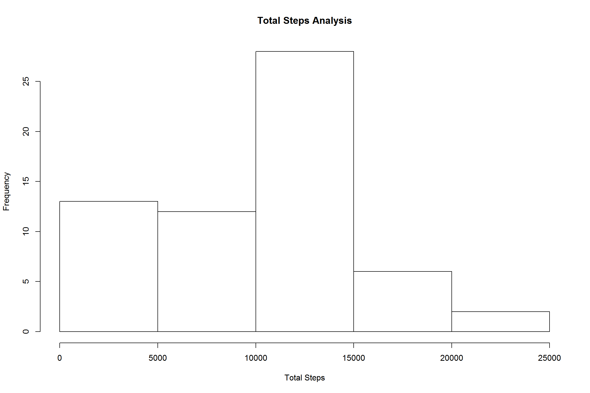
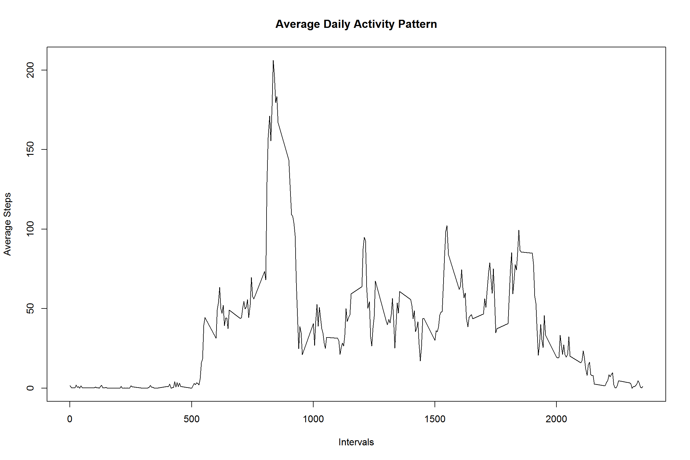
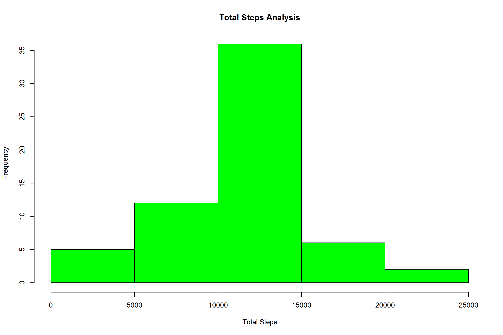
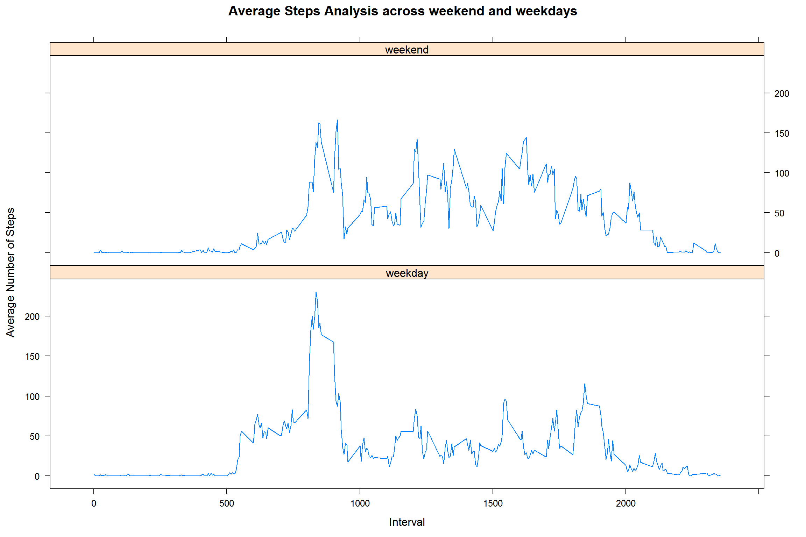

###### Author Vasudevan D
###### Date   09/Nov/2017 


## Loading and preprocessing the data

```r
## Load the Data
if(!file.exists('activity.csv')) {
  unzip('activity.zip')
}
 
actData <- read.csv("activity.csv")
summary(actData)
```

```
##      steps                date          interval     
##  Min.   :  0.00   2012-10-01:  288   Min.   :   0.0  
##  1st Qu.:  0.00   2012-10-02:  288   1st Qu.: 588.8  
##  Median :  0.00   2012-10-03:  288   Median :1177.5  
##  Mean   : 37.38   2012-10-04:  288   Mean   :1177.5  
##  3rd Qu.: 12.00   2012-10-05:  288   3rd Qu.:1766.2  
##  Max.   :806.00   2012-10-06:  288   Max.   :2355.0  
##  NA's   :2304     (Other)   :15840
```

```r
## Preprocess the Data for formatting the date fields
actData$date = as.Date(actData$date)
```

## What is mean total number of steps taken per day?

```r
## Included R packages necessary for processing
library(dplyr)

## Calculate the total number of steps taken per day
s1 <- group_by (actData, date)
stepsperday <- summarize(s1, stepsTotal = sum(steps, na.rm = TRUE))
print(stepsperday)
```

```
## # A tibble: 61 x 2
##          date stepsTotal
##        <date>      <int>
##  1 2012-10-01          0
##  2 2012-10-02        126
##  3 2012-10-03      11352
##  4 2012-10-04      12116
##  5 2012-10-05      13294
##  6 2012-10-06      15420
##  7 2012-10-07      11015
##  8 2012-10-08          0
##  9 2012-10-09      12811
## 10 2012-10-10       9900
## # ... with 51 more rows
```

```r
## If you do not understand the difference between a histogram and a barplot, research the difference between them. Make a histogram of the total number of steps taken each day
hist(stepsperday$stepsTotal, main = "Total Steps Analysis", xlab = "Total Steps")
```



```r
## Calculate and report the mean and median of the total number of steps taken per day
medianStepsperday <- median(stepsperday$stepsTotal)
meanStepsperday <- mean(stepsperday$stepsTotal)

## Median Steps per day 
print(medianStepsperday)
```

```
## [1] 10395
```

```r
## Mean Steps per day 
print(meanStepsperday)
```

```
## [1] 9354.23
```

## What is the average daily activity pattern?

```r
## Make a time series plot (i.e. type = "l") of the 5-minute interval (x-axis) and the average number of steps taken, averaged across all days (y-axis)
s2 <- group_by (actData, interval)
avgstepsperInterval <- summarize(s2, avgs = mean(steps, na.rm = TRUE))
print(avgstepsperInterval)
```

```
## # A tibble: 288 x 2
##    interval      avgs
##       <int>     <dbl>
##  1        0 1.7169811
##  2        5 0.3396226
##  3       10 0.1320755
##  4       15 0.1509434
##  5       20 0.0754717
##  6       25 2.0943396
##  7       30 0.5283019
##  8       35 0.8679245
##  9       40 0.0000000
## 10       45 1.4716981
## # ... with 278 more rows
```

```r
plot(avgstepsperInterval$interval, avgstepsperInterval$avgs, type = "l", main = "Average Daily Activity Pattern", xlab = "Intervals", ylab = "Average Steps")
```



```r
##Which 5-minute interval, on average across all the days in the dataset, contains the maximum number of steps?
maxStepsPerInterval <-avgstepsperInterval[which.max(avgstepsperInterval$avgs),]$interval
print(maxStepsPerInterval)
```

```
## [1] 835
```

## Inputing missing values


```r
## Calculate and report the total number of missing values in the dataset (i.e. the total number of rows with NAs)
totMisValues <- sum(is.na(actData$steps))
print (totMisValues)
```

```
## [1] 2304
```

```r
## Devise a strategy for filling in all of the missing values in the dataset. The strategy does not need to be sophisticated. For example, you could use the mean/median for that day, or the mean for that 5-minute interval, etc

## The Strategy to input the missing values would be mean for that interval and below function returns mean value for that interval 

getMissingValue <- function(interval) {
    avgstepsperInterval[avgstepsperInterval$interval == interval,]$avgs
}
    
## Create a new dataset that is equal to the original dataset but with the missing data filled in
refData <- actData
for (i in 1:nrow(refData))
{
 if(is.na(refData[i,]$steps)) {
      refData[i,]$steps <- getMissingValue(refData[i,]$interval)
   }    
}

summary(refData)
```

```
##      steps             date               interval     
##  Min.   :  0.00   Min.   :2012-10-01   Min.   :   0.0  
##  1st Qu.:  0.00   1st Qu.:2012-10-16   1st Qu.: 588.8  
##  Median :  0.00   Median :2012-10-31   Median :1177.5  
##  Mean   : 37.38   Mean   :2012-10-31   Mean   :1177.5  
##  3rd Qu.: 27.00   3rd Qu.:2012-11-15   3rd Qu.:1766.2  
##  Max.   :806.00   Max.   :2012-11-30   Max.   :2355.0
```

```r
## Make a histogram of the total number of steps taken each day and Calculate and report the mean and median total number of steps taken per day. Do these values differ from the estimates from the first part of the assignment? What is the impact of imputing missing data on the estimates of the total daily number of steps?

s3 <- group_by(refData, date)
refStepsperday <- summarize(s3, ST = sum(steps))
print(refStepsperday)
```

```
## # A tibble: 61 x 2
##          date       ST
##        <date>    <dbl>
##  1 2012-10-01 10766.19
##  2 2012-10-02   126.00
##  3 2012-10-03 11352.00
##  4 2012-10-04 12116.00
##  5 2012-10-05 13294.00
##  6 2012-10-06 15420.00
##  7 2012-10-07 11015.00
##  8 2012-10-08 10766.19
##  9 2012-10-09 12811.00
## 10 2012-10-10  9900.00
## # ... with 51 more rows
```

```r
hist(refStepsperday$ST, main = "Total Steps Analysis", col = "green", xlab = "Total Steps")
```



```r
## Median steps per day in refined data set 
refMedianstepsperday <- median(refStepsperday$ST)

## Mean Steps per day in refined data set 
refMeanstepsperday <- mean(refStepsperday$ST)

print(refMeanstepsperday)
```

```
## [1] 10766.19
```

```r
print(refMedianstepsperday)
```

```
## [1] 10766.19
```

```r
# The Median Steps had not changed much whereas the mean steps per day in the refined data set by inputting missing values increased by 10% 
```


## Are there differences in activity patterns between weekdays and weekends?


```r
## Create a new factor variable in the dataset with two levels - "weekday" and "weekend" indicating whether a given date is a weekday or weekend day.
refData$day <- weekdays(refData$date)

for (j in 1:nrow(refData)){
    
    if(refData[j,]$day %in% c("Saturday", "Sunday")){
        refData[j,]$day <- "weekend"
    }
    else {
        refData[j,]$day <- "weekday"
    }
}
summary(refData)
```

```
##      steps             date               interval          day           
##  Min.   :  0.00   Min.   :2012-10-01   Min.   :   0.0   Length:17568      
##  1st Qu.:  0.00   1st Qu.:2012-10-16   1st Qu.: 588.8   Class :character  
##  Median :  0.00   Median :2012-10-31   Median :1177.5   Mode  :character  
##  Mean   : 37.38   Mean   :2012-10-31   Mean   :1177.5                     
##  3rd Qu.: 27.00   3rd Qu.:2012-11-15   3rd Qu.:1766.2                     
##  Max.   :806.00   Max.   :2012-11-30   Max.   :2355.0
```

```r
##Make a panel plot containing a time series plot (i.e. type = "l") of the 5-minute interval (x-axis) and the average number of steps taken, averaged across all weekday days or weekend days (y-axis). See the README file in the GitHub repository to see an example of what this plot should look like using simulated data.

s4 <- group_by(refData, interval,day)
refSteps <- summarize(s4, stepT = mean(steps))
summary(refSteps)
```

```
##     interval          day                stepT        
##  Min.   :   0.0   Length:576         Min.   :  0.000  
##  1st Qu.: 588.8   Class :character   1st Qu.:  2.047  
##  Median :1177.5   Mode  :character   Median : 28.133  
##  Mean   :1177.5                      Mean   : 38.988  
##  3rd Qu.:1766.2                      3rd Qu.: 61.263  
##  Max.   :2355.0                      Max.   :230.378
```

```r
## To include lattice package for plotting 
library(lattice)

xyplot(stepT ~ interval | day,refSteps, type = "l", layout = c(1,2), xlab = "Interval" , ylab = "Average Number of Steps", main= "Average Steps Analysis across weekend and weekdays" )
```



